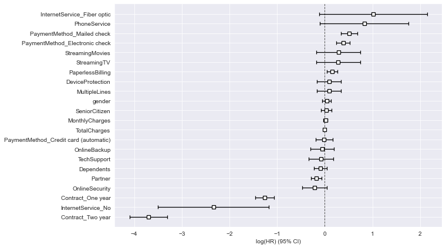

## Churn and Survival Analysis

This repo contains code to perform customer survival analysis and build a model which can predict customer churn for data about some telecom customers.

#### Survival Analysis: 
It is a set of methods for analyzing data where the outcome variable is the time until the occurrence of an event of interest, which can be death, occurrence of a disease, marriage, divorce, etc. The time to event or survival time can be measured in days, weeks, years, etc. The objective of this analysis is to utilize non-parametric and semi-parametric methods of survival analysis to answer questions like:
- likelihood of the customer churn changing over time
- modeling the relationship between customer churn, time, and other customer attributes
- significant factors that drive customers to churn
- plot survival and hazard curve of a specific customer
- expected lifetime value of a customer

#### Survival Function:
The Survival Function is given by,
    S(t) = P(T>t)
It is the probability that the event of interest has not occurred at time t. It can also be interpreted as the probability of survival after time t. Here, T is the random lifetime taken from the population and it cannot be negative. 

#### Hazard Function
It is the probability that the subject will experience an event of interest within a small time interval, provided that the individual has survived until the beginning of that interval. It is the instantaneous rate calculated over a time period and this rate is considered constant. 

#### Kaplan-Meier Survival Curve:
It is also known as the product limit estimator, and is a non-parametric statistic used to estimate the survival function from lifetime data. A plot of the Kaplan–Meier estimator is a series of declining horizontal steps which, with a large enough sample size, approaches the true survival function for that population. The value of the survival function between successive distinct sampled observations ("clicks") is assumed to be constant.

#### Log-rank test:
The test is carried out to analyze churning probabilities group wise and to find if there is statistical significance between groups.

#### Survival Regression
It involves utilizing not only the duration and the censorship variables but using additional data (Gender, Age, Salary, etc) as covariates. The dataset used for Survival Regression needs to be in the form of a (Pandas) DataFrame with a column denoting the duration the subjects, an optional column indicating whether or not the event of interest was observed, as well as additional covariates you need to regress against. Like with other regression techniques, you need to preprocess your data before feeding it to the model.

#### Churn prediction
This means detecting which customers are likely to leave a service or to cancel a subscription to a service. It is a critical prediction for many businesses because acquiring new clients often costs more than retaining existing ones. Churn prediction modelling techniques attempt to understand the precise customer behaviours and attributes that signal the risk and timing of customers leaving. 

#### Partial dependence 
This plot is used to see how churning probability changes across the range of particular feature.

#### Explainability
Permutation Importance shows feature importance by randomly shuffling feature values and measuring how much it degrades our performance.

#### SHAP values (SHapley Additive exPlanations)
It is a game theoretic approach to explain the output of any machine learning model. One can see that why a particual customer's churning probability is less than baseline value and which features are causing them.

#### Additional reading resources 
- https://towardsdatascience.com/survival-analysis-part-a-70213df21c2e
